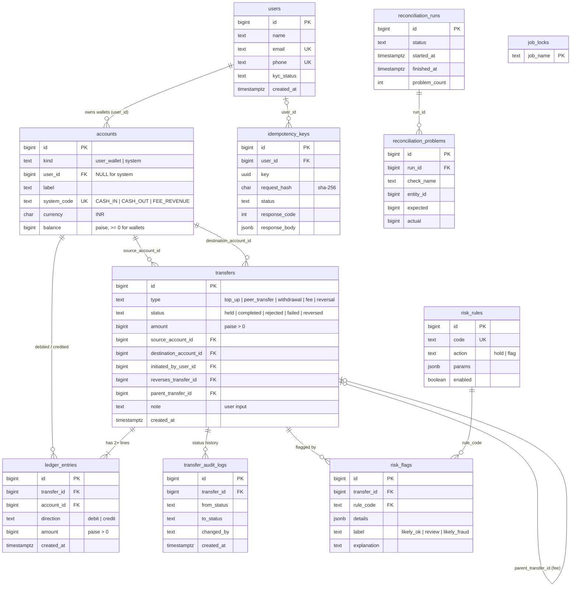

# Schema design (Milestone 1)

Designed before any application code. The migrations that build it from an empty database are in
[`migrations/`](../migrations): `001_core_schema.sql` (money), `002_idempotency_audit.sql`,
`003_reconciliation_risk.sql`.

Conventions: plural `snake_case` tables, singular columns, `BIGINT GENERATED ALWAYS AS IDENTITY` primary
keys everywhere, money in whole **paise** as `BIGINT` (never float), timestamps are `timestamptz`.

## 1. Noun list: what became a table and why

I wrote down every noun in the requirements and asked: *do we need to store extra information about it?*

| Noun | Table? | Why |
|---|---|---|
| user | **`users`** | Has its own attributes (name, email, phone, KYC status) and many wallets. |
| wallet | **`accounts`** (`kind = 'user_wallet'`) | Has a balance, a label and an owner. One user, many wallets. |
| system account (cash-in, cash-out, fee revenue) | **`accounts`** (`kind = 'system'`) | The ledger only needs "something that can be debited or credited". Same table, no owner. |
| transfer | **`transfers`** | The business event: type, status, amount, time, link to the original when reversed. |
| ledger entry | **`ledger_entries`** | One debit or credit line on exactly one account. This is also the mapping table that resolves the M:N between transfers and accounts. |
| idempotency key | **`idempotency_keys`** | Needs a request hash, a status and the saved response. |
| audit log (of status changes) | **`transfer_audit_logs`** | Many rows per transfer: from, to, who, when. |
| fraud rule | **`risk_rules`** | Thresholds must live in data, not in code. |
| flag / hold | **`risk_flags`** | Which rule fired for which transfer, what it saw, and the nightly LLM explanation. |
| nightly report | **`reconciliation_runs`** + **`reconciliation_problems`** | One row per run, one row per problem found. |
| job (lock) | **`job_locks`** | A row per job to `SELECT ... FOR UPDATE NOWAIT` on, so only one run happens at a time. |
| KYC status | column `users.kyc_status` | A single value with three states and nothing else to store about it. |
| currency | column `currency CHAR(3)` with `CHECK (currency = 'INR')` | INR only. Kept as a column (with a CHECK) so adding a currency later is a constraint change, not a redesign. |
| transfer type, transfer status | columns with `CHECK (... IN (...))` | Small fixed sets, no extra attributes. A lookup table would add a join for no information. |
| direction (debit / credit) | column on `ledger_entries` | Two values. |
| balance | column `accounts.balance` | Derived but stored on purpose (see README, question 1). |
| statement | *none* | It is a **query** over `ledger_entries`, not stored data. |
| phone, email, name | columns | Data we do not control. Never keys (README, question 3). |

## 2. Cardinality and where each foreign key lives

| Relationship | Cardinality | Foreign key |
|---|---|---|
| user → wallets | 1 : M (a user has many wallets, a wallet has one owner) | `accounts.user_id` (the "many" side). `NULL` for system accounts, enforced by `accounts_kind_shape`. |
| transfer → ledger entries | 1 : M, **at least 2** | `ledger_entries.transfer_id` |
| account → ledger entries | 1 : M | `ledger_entries.account_id` |
| accounts ↔ transfers | M : N (an account takes part in many transfers, a transfer touches 2+ accounts) | resolved by **`ledger_entries`**, which carries extra attributes (direction, amount) |
| transfer → source / destination account | M : 1 twice | `transfers.source_account_id`, `transfers.destination_account_id` (convenience columns for the common 2-leg case, used by fraud rules and the "last 10 transfers" query) |
| transfer → its reversal | 1 : 0..1 | `transfers.reverses_transfer_id` on the reversal row, with a partial unique index (a transfer can be reversed once) |
| transfer → its fee | 1 : 0..1 | `transfers.parent_transfer_id` on the fee row, unique |
| transfer → audit log rows | 1 : M | `transfer_audit_logs.transfer_id` |
| transfer → risk flags | 1 : M (one row per rule that fired) | `risk_flags.transfer_id`, unique `(transfer_id, rule_code)` |
| risk rule → risk flags | 1 : M | `risk_flags.rule_code → risk_rules.code` |
| user → idempotency keys | 1 : M | `idempotency_keys.user_id` (nullable for sign-up / admin requests) |
| reconciliation run → problems | 1 : M | `reconciliation_problems.run_id` |

## 3. ER diagram

## 4. Let the database protect you

| Rule | Enforced by |
|---|---|
| A user wallet balance never goes below zero (system accounts may) | `CHECK (kind = 'system' OR balance >= 0)` on `accounts` |
| A wallet has an owner, a system account has none | `accounts_kind_shape` CHECK |
| Entry amounts are positive | `CHECK (amount > 0)`; direction stored separately (see below) |
| Ledger entries are never updated, deleted or truncated | `BEFORE UPDATE OR DELETE` row trigger + `BEFORE TRUNCATE` trigger that raise an error |
| Debits = credits = transfer amount, for every transfer | **deferred constraint trigger** on `ledger_entries`, checked at `COMMIT` (so both legs may be inserted by two statements) |
| A reversal points to an original; only reversals do; a transfer is reversed at most once | `CHECK ((type = 'reversal') = (reverses_transfer_id IS NOT NULL))` + partial unique index |
| Idempotency key unique per user | `UNIQUE (user_id, key)` (partial unique index; a second one covers `user_id IS NULL`) |
| Audit log is append-only | same immutability triggers |
| INR only, positive transfer amount, source <> destination | CHECK constraints |

**Positive amount + direction, or signed amounts?** I chose positive amounts with a `direction` column.
A positive-only amount makes "`amount > 0`" a trivial CHECK that rejects whole classes of bugs (a negative
amount would silently flip a debit into a credit). Reading a statement is clearer ("debit 500"), and the
sign only appears in one place: `credits - debits`. The cost is a `CASE direction WHEN 'credit' THEN amount ELSE -amount END`
in sums. Signed amounts would make `SUM(amount)` a one-liner but allow `amount = 0` and make a wrong sign
look valid.

**Balance convention.** For *every* account, `balance = SUM(credits) - SUM(debits)`. A user wallet is
credited when it receives money. `CASH_IN` is debited on every top-up and therefore trends negative, which
is allowed for system accounts and mirrors the bank balance backing all wallets.

## 5. Indexes, and what each costs on write

| Index | Serves | Write cost |
|---|---|---|
| `ledger_entries (account_id, created_at DESC, id DESC)` | statement: `WHERE account_id = $1 ORDER BY created_at DESC, id DESC` (offset and cursor) | one extra index insert per ledger line: the hot-path index; worth it |
| `ledger_entries (transfer_id)` | per-transfer balance trigger, reversal and orphan checks, FK lookups | one insert per ledger line |
| `transfers (source_account_id, created_at DESC)` | fraud rules (velocity, daily volume, fan-out), "last 10 transfers" | one insert per transfer |
| `transfers (destination_account_id, created_at DESC)` | same, for the receiving side / top-ups | one insert per transfer |
| partial `transfers (status, created_at) WHERE status = 'held'` | the admin review queue | **tiny**: only held rows are indexed |
| partial unique `transfers (reverses_transfer_id)`, `(parent_transfer_id)` | one reversal / one fee per transfer | only rows that use them |
| `idempotency_keys (user_id, key)` unique | the concurrency referee | needed for correctness |
| `idempotency_keys (created_at)` | the 24 h purge | small table, cheap |
| `risk_flags (created_at)` | the nightly "flags of the day" scan | flags are rare |
| `accounts (user_id, label)` unique, `accounts (system_code)` unique | one wallet per label; system lookup | small table |

Indexes I deliberately did **not** add: nothing on `ledger_entries.created_at` alone (no query needs it),
nothing on `transfers.type`, nothing on `users.name` (the Q&A name match scans only the caller's own
counterparties). Every index is one more B-tree to update inside the transfer transaction while row locks are held,
so each one lengthens the critical section.
